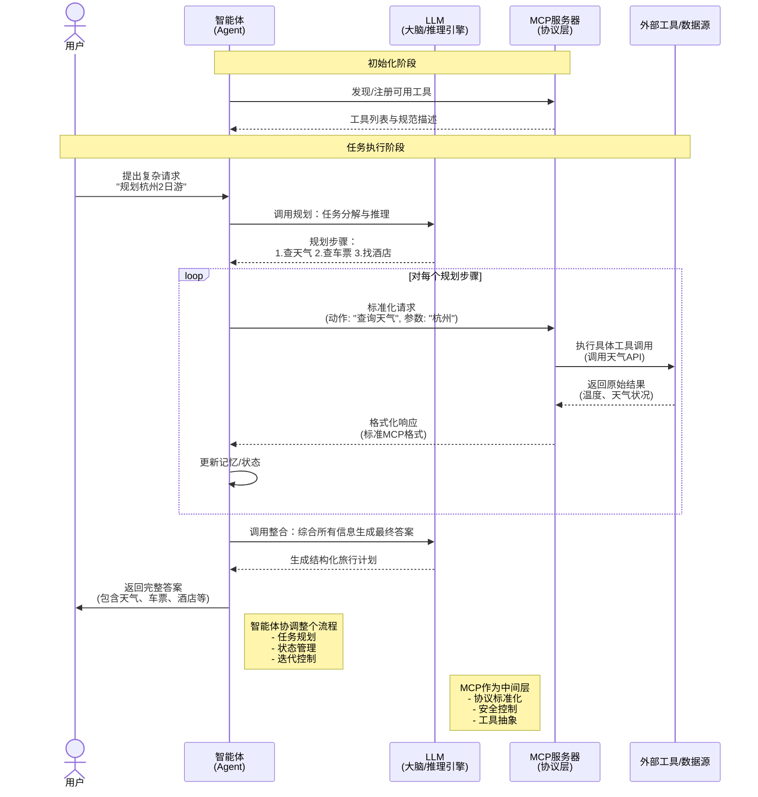
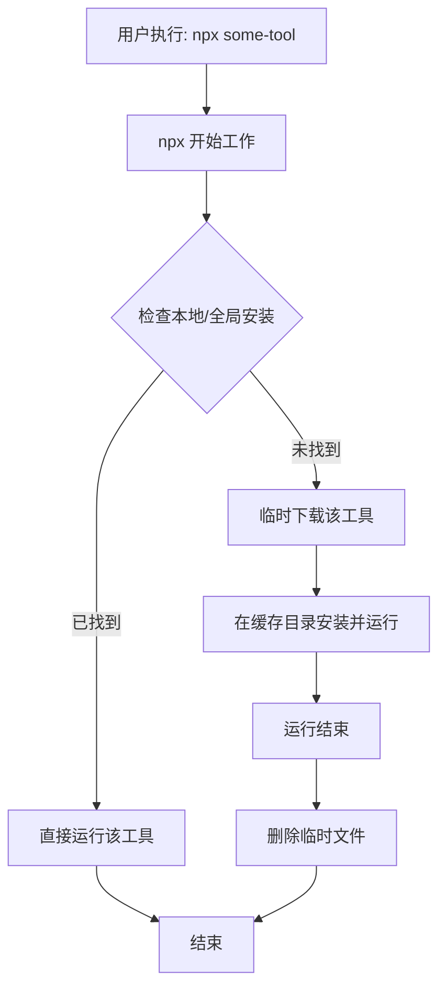

## AI IDE(TRAE)
1. https://docs.trae.ai/ide/what-is-trae?_lang=zh
### 智能体/LLM/MCP关系

## npx/uvx
> npx 的本质是一个智能的包执行调度器。它将“安装”和“运行”这两个动作无缝地结合在了一起，让你感觉工具是“召之即来，挥之即去”的。它通过临时缓存目录和隔离的执行环境，从根本上避免了全局安装带来的污染、冲突和安全问题，极大地改善了开发者的工作流
- npx：依赖于 Node.js，版本需大于等于 18。 
- uvx：命令行工具，用于快速运行 Python 脚本
1. 工作原理
