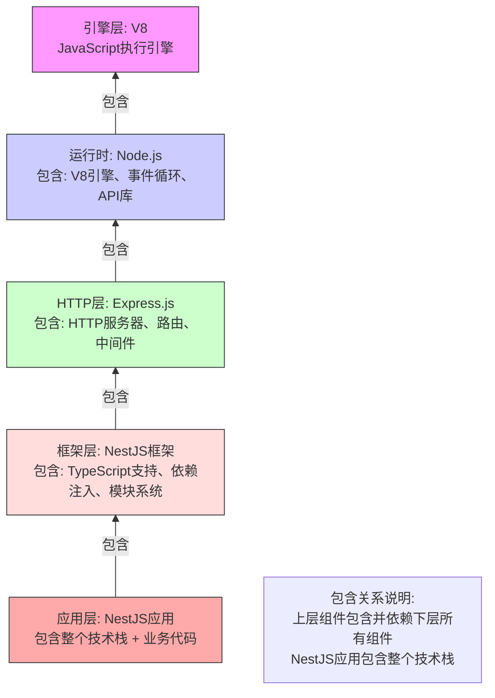
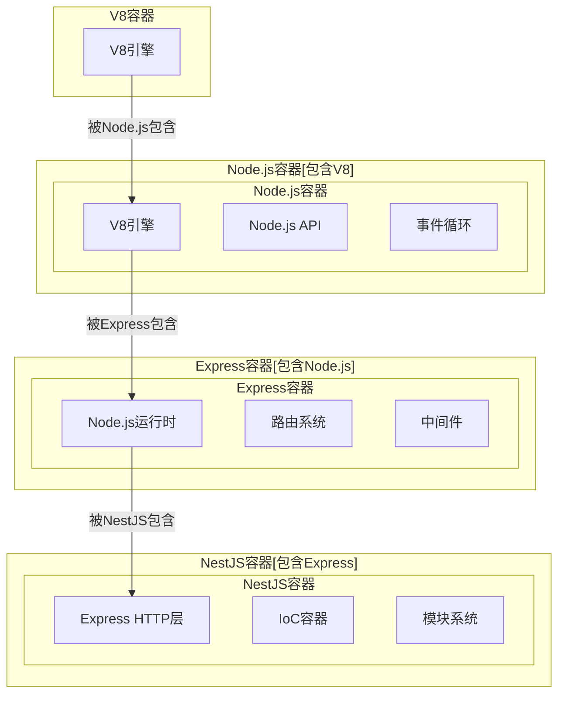

# petshop
## 技术选型
### 前端方案
#### Flutter
前后端分离
Flutter前端 (各平台) → REST/GraphQL API → 后端服务层 → MongoDB集群
前端UI层: Flutter (Dart)
- ✅ 真正跨平台：一套代码生成iOS/Android App、Windows桌面端、Web版
- ✅ 性能接近原生，支持复杂交互
- ✅ 丰富的组件库和成熟的生态
- ✅ 热重载提高开发效率

部署方案:
  - 移动端: Flutter编译原生应用
  - 桌面端: Flutter Desktop (Windows/macOS)
  - Web版: Flutter Web + PWA

  Flutter框架: 
  - Flutter 3.19+ (支持最新桌面端)
  - 状态管理: Riverpod 2.0 (推荐) 或 BloC
  - UI组件库: 
    * 基础: Flutter原生组件
    * 增强: fluent_ui (Windows风格) 或 material_you
    * 图表: fl_chart
    * 表格: syncfusion_flutter_datagrid (商业) 或 pluto_grid (开源)

#### React
- React Native(App) 
- React Native Web (App & H5)
- Tauri (桌面)
### 后端方案
推荐方案A: Go + Gin (高性能，适合宠物医院场景)
  - Web框架: Gin
  - MongoDB驱动: mongo-go-driver
  - 认证: JWT + RBAC
  - API文档: Swagger/OpenAPI
  - 部署: Docker + Kubernetes(可选)

推荐方案B: Node.js + NestJS (全栈JavaScript)
  - 框架: NestJS (TypeScript)
  - ORM: Mongoose
  - 认证: Passport.js
  - 实时通信: Socket.io
### 通讯方案
- REST
- GraphQL
- WebSocket ：https://copilot.microsoft.com/chats/EFzASEze2fFdy4zbGYPuZ

##

## 知识图谱

